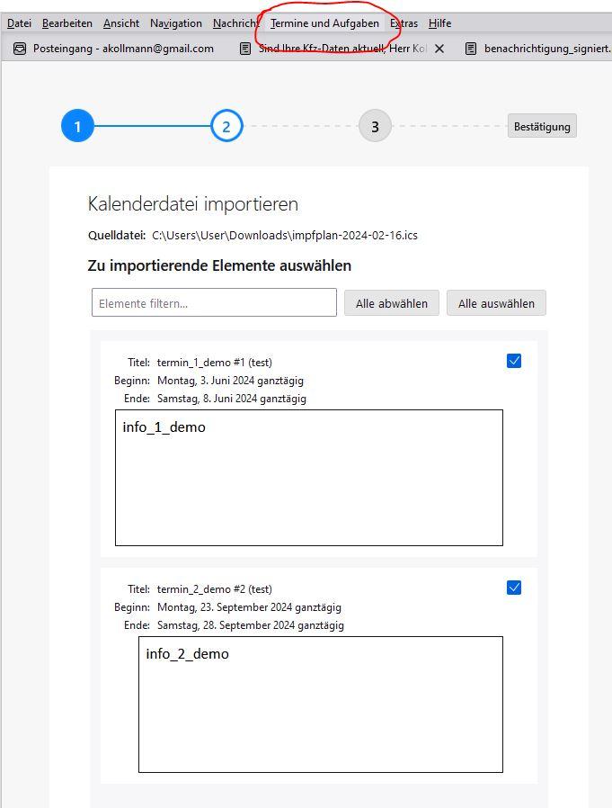

# (Kinder)Impfkalender - Einträge erstellen

Python-Anwendung, die aus einem Startdatum (= Geburtsdatum) und Offsets (+ xx Monate) Kalendereinträge mit Reminder für den Import in Outlook, Thunderbird, GMAIL, etc. erstellt.

* INPUT (CSV im Arbeitsverzeichnis):
* * Impfung, Teilimpfung, Offset in Monaten, Info, Reminder. Diese Infos wurden aus dem Impfkalender für Säuglinge und Kleinkinder der Stadt Wien übernommen (https://www.wien.gv.at/gesundheit/beratung-vorsorge/impfen/kalender/kleinkinder.html)
* OUTPUT: ICAL, PDF, CSV (werden im Download-Verzeichnis abgeleget))

Verfügbar als:
* Python Flask-Anwendung unter: https://alexontour.pythonanywhere.com/
* Google-Collab-Script

## Beispiel Import Thunderbird

